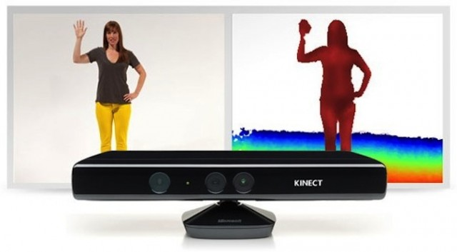
# Apuntes Kinect


---

### Temario

+++

### Hardware  

- v1
    - Características
    - Requerimientos
- v2 __(one for XBox)__
    - Características
    - Requerimientos
- Drivers e Instalación

+++

### Software  

- Processing
    - OpenKinect
    - SimpleOpenNI
    - BlobDetection
    - oscP5
- OpenFrameworks
    - ofxKinect
    - ofxOpenCv
    - ofxOsc
- Kinect SDK
- Synapse

+++

### Code: Basics  

- Cámara RGB
- Imagen infrarroja
- Mapa e imagen de profundidad
- Nube de puntos

+++

### Code: Tracking  

- RAW Data
- Detección de objetos **(en un rango específico)**
- Centroide **(del obejto detectado)**
- Punto Extremo **(ej. el más alto)**
- Blobs

+++

### Code: Skeleton

- Esqueleto **(articulaciones)**
- Motion Capture **(testing)**
- Synapse **(win/mac)**
- Distancia entre dos **"Joints"**
- Kinect SDK (win)

+++

### Code: Communication

- OSC, MIDI y Serial
    - Características
    - Resolume
    - Isadora
    - Arduino
- Múltiples kinects

+++

### Casos

+++

### Bonus
### Bibliografía
### Cierre


---

## Sensor Kinect  

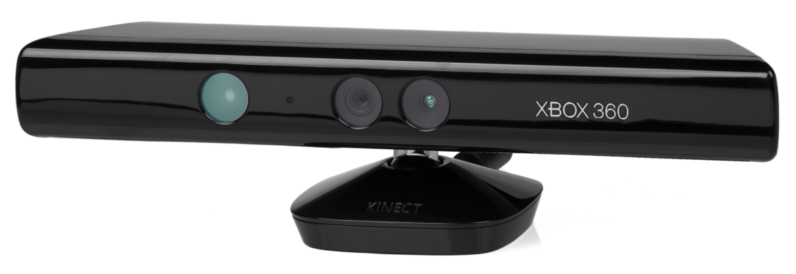


+++

<!-- <video width="640" height="480" controls><source src="./assets/md/assets/videos/seventh-sense.mp4" type="video/mp4"></video><br> -->
  

<span style="color: #562F99">Seventh Sense (Excerpt)</span>  

<span style="color: #AADC69">Anarchy Dance Theatre + Ultra Combos</span>  


+++

<!-- <video width="640" height="480" controls><source src="./assets/md/assets/videos/the_v_motion_project.mp4" type="video/mp4"></video><br> -->
  

<span style="color: #562F99">The V Motion Project </span>  

<span style="color: #AADC69">Colenso BBDO</span>  


+++

### v1  

  

Salió a finales de 2010.  

La profundidad de captura va de **0.5** a **4.5 metros**.  

Envía data a **30 FPS** con una resolución de **640x480** para el RGB y **320x240** para el D.


+++

#### Requerimientos  
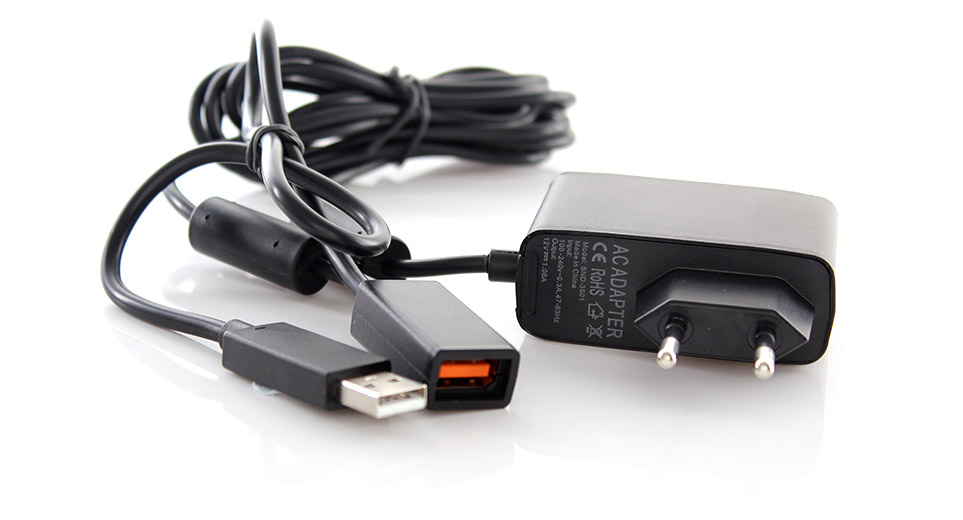  

- Modelos compatibles: 1414 y 1473 __(este último trae algunos bugs)__
- Necesita un adaptador especial
- Se puede usar con Win, Mac y Linux
- USB 2.0


+++

### v2

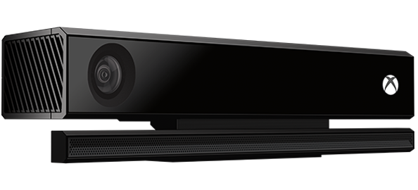  

Salió a finales de 2013. La profundidad de captura es igual.  

Envía data a **30 FPS** con una resolución de **1920x1080** para el RGB y **512x424** para el D.  

Trae una imagen __"Registered"__ que alinea la camara RGB con la D.


+++

#### Requerimientos  

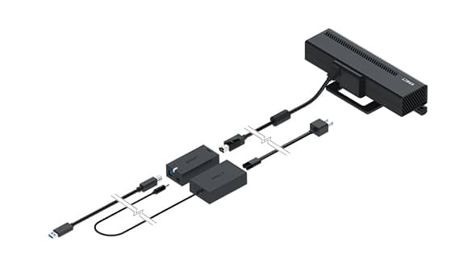  

- Necesita un adaptador **MUY** especial __(no hay genéricos)__
- Se puede usar con Win8+ __(W8 64 bit)__ y Mac __(OSx >= 10.9; sin análisis de imagen)__
- USB 3.0


+++

#### Drivers


+++

  

[https://openkinect.org](https://openkinect.org)  

__RGB e imágen de profundidad (Depth) y Motor__  

__Acelerómetro, LED, Audio__

<small>
##### v1: [https://github.com/OpenKinect/libfreenect](https://github.com/OpenKinect/libfreenect)
##### v2: [https://github.com/OpenKinect/libfreenect2](https://github.com/OpenKinect/libfreenect2)
##### Guía: https://openkinect.org/wiki/Getting_Started
</small>

+++

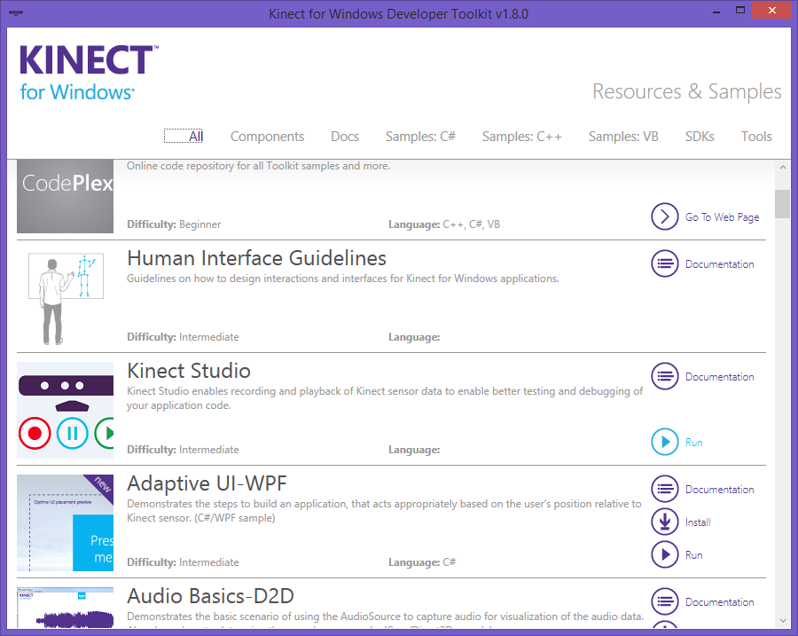  

[https://developer.microsoft.com/en-us/windows/kinect](https://developer.microsoft.com/en-us/windows/kinect)  

__RGB e imágen de profundidad (Depth) y Motor__  

__Acelerómetro, LED, Audio__


---

## Processing
  

[http://processing.org/](http://processing.org/)


+++

### Open Kinect for Processing
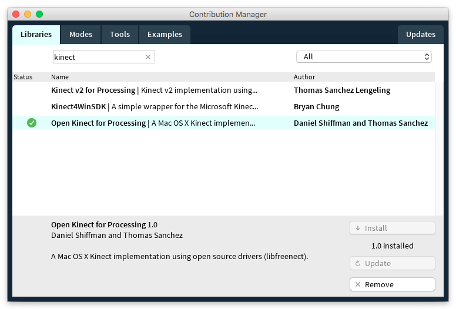  

https://github.com/shiffman/OpenKinect-for-Processing


+++

### SimpleOpenNi
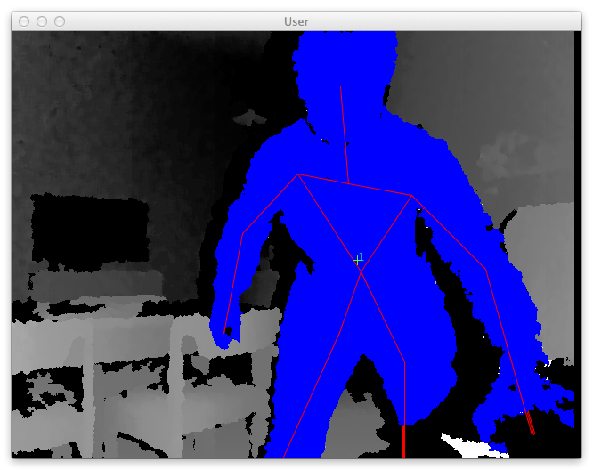  

Reconocimiento de las uniones del cuerpo humano.  

Librería: https://github.com/wexstorm/simple-openni  

Driver: https://structure.io/openni _(Sólo windows y linux)_


+++

### Kinect v2 for Processing
  

Se basa en el SDK oficial de Microsoft.  

Necesita correr en Windows.


---

## CODE 1   

<span style="color:gray;">Basics</span>

+++

```java
import org.openkinect.processing.*;

Kinect kinect; 

void setup() {
   kinect = new Kinect(this);
   //kinect.initVideo();
}

void draw() {
   //PImage img = kinect.getVideoImage();
   //image(img, 0, 0);
}
```

+++

### <span style="color:#562F99">1.</span> Cámara RGB
```java
// Setup
kinect.initVideo();
// Draw
kinect.enableMirror(true); // para espejar
PImage img = kinect.getVideoImage();
```

+++

### <span style="color:#562F99">2.</span> Imagen infrarroja
```java
// Setup
kinect.initVideo();
kinect.enableIR(true);
// Draw
PImage img = kinect.getVideoImage();
```

+++

### <span style="color:#562F99">3.</span> Imagen de profundidad
```java
// Setup
kinect.initDepth();
kinect.enableColorDepth(true); // si queremos mapa de color
// Draw
PImage img = kinect.getDepthImage();
```

+++

### <span style="color:#562F99">4.</span> Nube de puntos
```java
// Setup
size(640, 480, P3D); // Usar el render en P3d
kinect.initDepth();
// Draw
PImage img = kinect.getVideoImage();
```

+++

#### Otras funciones
**enableColorDepth(boolean)** — mostrar profundidad en color  


#### Sólo V1
**enableMirror(boolean)** — espejar imagen  

**float getTilt()** — consultar angulo del motor  

**setTilt(float)** — definir angulo del motor (entre -30 y 30)  


#### Sólo V2
**PImage getRegisteredImage()** — imagen con correspondencia RGB+D  


---

## CODE 2  

<span style="color:gray;">Tracking</span>


+++

### <span style="color:#562F99">1a.</span> RAW Data
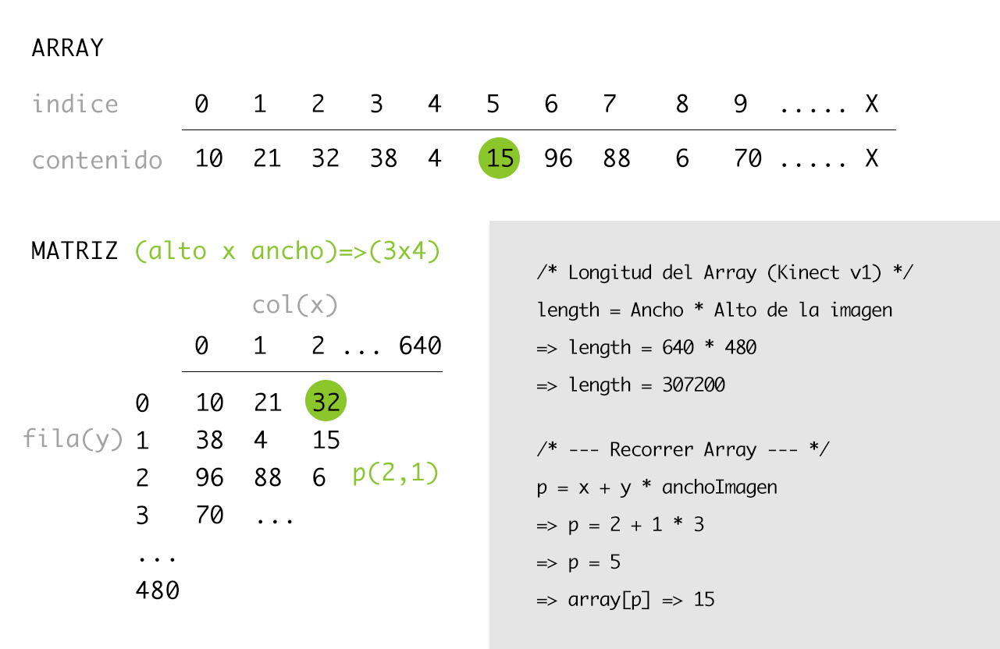  


+++

### <span style="color:#562F99">1b.</span> RAW Data
```java
// Setup
size(640, 480, P3D); // Usar el render en P3d
kinect.initDepth();
// Draw
int[] data = kinect.getRawDepth();
for (int x=0; xSkeleton</span>


+++

<span style="color:gray;">Interfaz Natural de Usuario (NUI)</span>  

Se interactúa con una aplicación mediante movimientos gestuales del cuerpo o de alguna de sus partes como las manos.
También existe el control de sistemas operativos por medio de la voz humana, denominado control por reconocimiento del habla o reconocimiento de voz, como por ejemplo Siri, Google Now u OK Google.


+++

<!-- <video width="640" height="480" controls><source src="./assets/md/assets/videos/nui.mp4" type="video/mp4"></video><br> -->
  


+++

### Skeleton
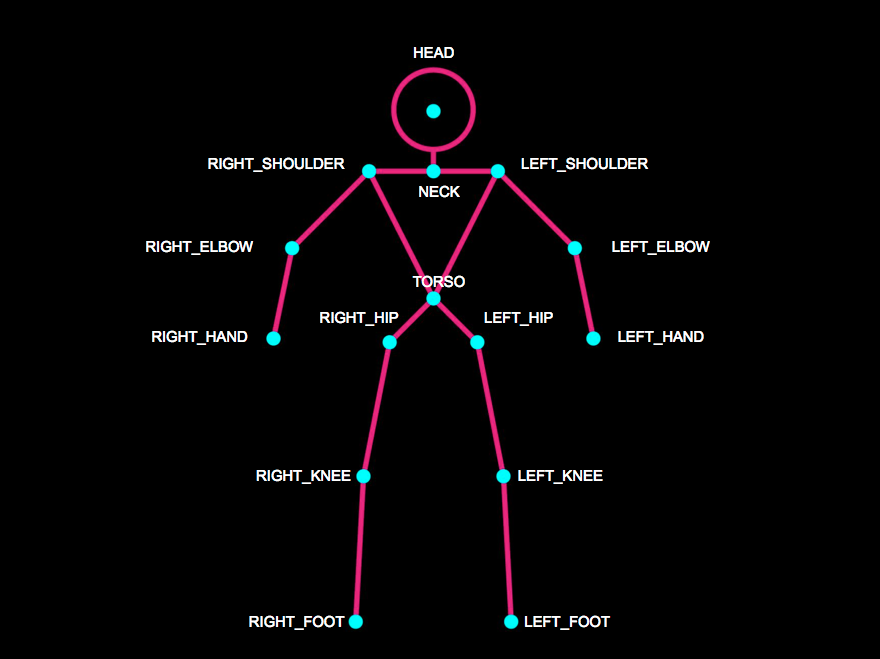  


+++

### Motion Capture

<!-- <video width="640" height="480" controls><source src="./assets/md/assets/videos/distanceMeasurement.mp4" type="video/mp4"></video><br> -->
  


+++

### Distancia entre dos Joints

<!-- <video width="640" height="480" controls><source src="./assets/md/assets/videos/distanceMeasurement.mp4" type="video/mp4"></video><br> -->
  


+++

### Synapse
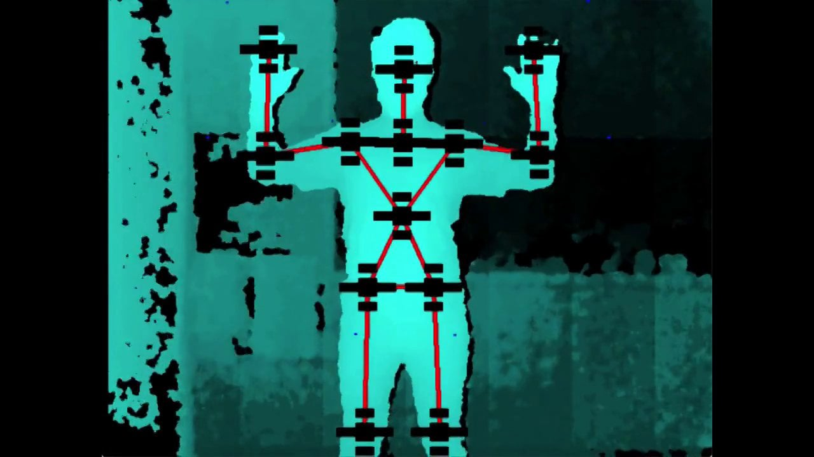  

[http://synapsekinect.tumblr.com/](http://synapsekinect.tumblr.com/)  

Puerto OSC: 12345 y 12347


+++

### Kinect SDK
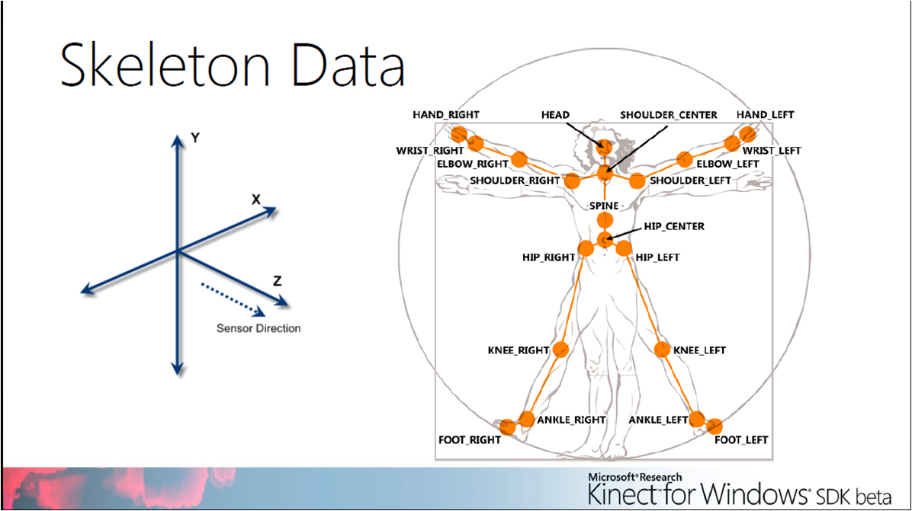  


---

## OSC  

<span style="color:gray;">Open Sound Control</span> 

Protocolo de comunicación para compartir información, por red y en tiempo real, entre aplicaciones y dispositivos.  

Es "el sucesor del MIDI" porque ofrece un control mucho más preciso y una increíble flexibilidad.  

[http://opensoundcontrol.org/](http://http://opensoundcontrol.org/)

+++

### Librería para ENVIAR y RECIBIR mensajes

```java
import oscP5.*;
import netP5.*;
// SETUP
oscP5 = new OscP5(this, 9000); // Escuchar: Puerto 9000
miServidor = new NetAddress("192.168.1.112", 12345); // Enviar: IP, Puerto
// Enviar mensajes
void mousePressed() {
  OscMessage miMensaje = new OscMessage("/md8key/ctrl_layer_media/1");
  miMensaje.add( 8 );
  oscP5.send(miMensaje, miServidor);
}
// Recibir mensajes
void oscEvent(OscMessage elMensaje) {
    println("pattern: "+elMensaje);
    println("tipo: "+elMensaje.typetag());
}
```

+++

### Resolume

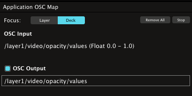  

[Documentación](https://resolume.com/manual/es/r4/controlling#open_sound_control_osc)

### [Synapse](http://synapsekinect.tumblr.com/post/6305020721/download)
### Kinect + Isadora
### Kinect + Arduino


---

## OpenFrameworks
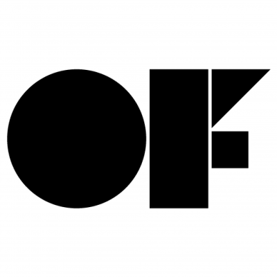  

[http://openframeworks.cc/](http://openframeworks.cc/)

+++

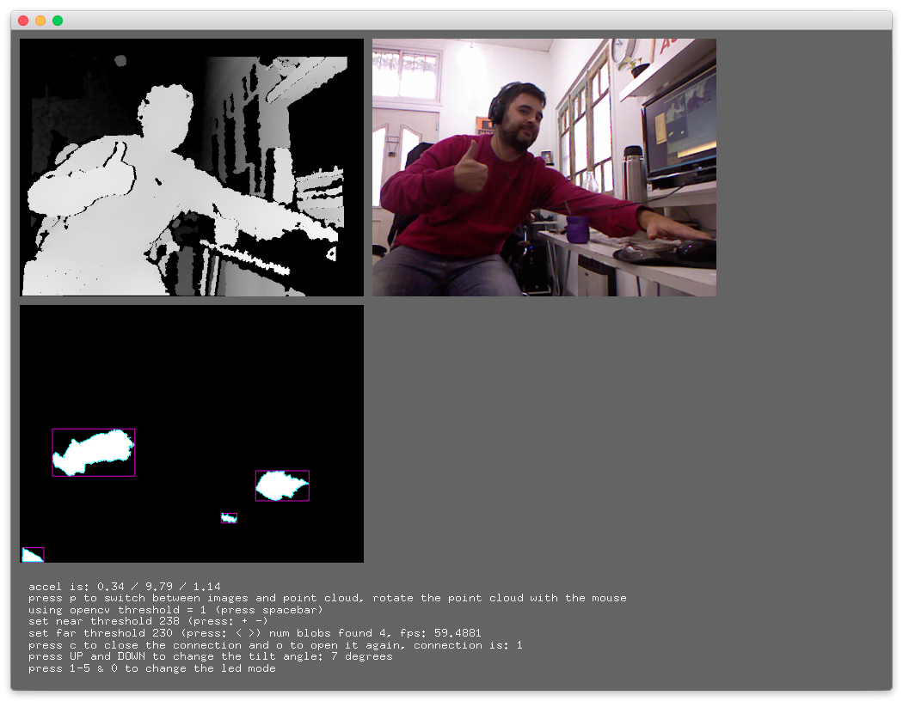  

1. ofxKinect


---

## CASOS  

<span style="color:gray;">Parte 1</span>

+++

<!-- <video width="640" height="480" controls><source src="./assets/md/assets/videos/mechanical-mirrors.mp4" type="video/mp4"></video><br> -->
  

<span style="color: #562F99">Mechanical Mirrors - Daniel Rozin</span>  

<span style="color: #AADC69">Análisis de profundidad</span>  


+++

<!-- <video width="640" height="480" controls><source src="./assets/md/assets/videos/iris-hybe.mp4" type="video/mp4"></video><br> -->
  

<span style="color: #562F99">Iris - HYBE Collective</span>  

<span style="color: #AADC69">Análisis de profundidad</span>  


+++

<!-- <video width="640" height="480" controls><source src="./assets/md/assets/videos/musica.mp4" type="video/mp4"></video><br> -->
  

<span style="color: #562F99">Música (Tan Biónica) - QUALE Studio</span>  

<span style="color: #AADC69">Point Cloud | RGBD</span>  


+++

<!-- <video width="640" height="480" controls><source src="./assets/md/assets/videos/phantom.mp4" type="video/mp4"></video><br> -->
  

<span style="color: #562F99">Phantom (Scars) - Julius Tuomisto & Janne Karhu</span>  

<span style="color: #AADC69">Point Cloud | RGBD</span>  


+++

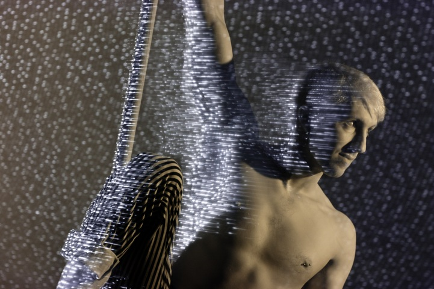  

<span style="color: #562F99">[Kinect’s Dazzling Infrared Lights Disco](http://mymodernmet.com/audrey-penven-dancing-with-invisible-light/)</span>  

<span style="color: #AADC69">Fotografía de patrones IR</span>  


+++

<!-- <video width="640" height="480" controls><source src="./assets/md/assets/videos/nikefuel_station.mp4" type="video/mp4"></video><br> -->
  

<span style="color: #562F99">Nike Fuel Station | Onformative</span>  

<span style="color: #AADC69">Análisis de profundidad</span>  


+++

<!-- <video width="640" height="480" controls><source src="./assets/md/assets/videos/fabricate-yourself.mp4" type="video/mp4"></video><br> -->
  

<span style="color: #562F99">Fabricate Yourself</span>  

<span style="color: #AADC69">Análisis de profundidad</span>  


---

## CASOS  
<span style="color:gray;">Parte 2</span>

+++

<!-- <video width="640" height="480" controls><source src="./assets/md/assets/videos/quantum-120944206.mp4" type="video/mp4"></video><br> -->
  

<span style="color: #562F99">Quantum Space | Kuflex</span>  

<span style="color: #AADC69">Análisis de RAW Data</span>  


+++

<!-- <video width="640" height="480" controls><source src="./assets/md/assets/videos/34533540-lozano.mp4" type="video/mp4"></video><br> -->
  

<span style="color: #562F99">Locomoción | QUALE Studio</span>  

<span style="color: #AADC69">Average Point Tracking</span>  


+++

<!-- <video width="640" height="480" controls><source src="./assets/md/assets/videos/34533540-lozano.mp4" type="video/mp4"></video><br> -->
  

<span style="color: #562F99">Tape Recorders | Rafael Lozano-Hemmer</span>  

<span style="color: #AADC69">Average Point Tracking</span>  


+++

<!-- <video width="640" height="480" controls><source src="./assets/md/assets/videos/firewall_640x360.mp4" type="video/mp4"></video><br> -->
  

<span style="color: #562F99">Firewall | Aaron Sherwood & Michael Allison</span>  

<span style="color: #AADC69">Blob detection | OSC</span>  


+++

<!-- <video width="640" height="480" controls><source src="./assets/md/assets/videos/derivations.mp4" type="video/mp4"></video><br> -->
  

<span style="color: #562F99">Derivations | Raven Kwok</span>  

<span style="color: #AADC69">Blob Detection</span>  


---

## CASOS  
<span style="color:gray;">Parte 3</span>


+++

<!-- <video width="640" height="480" controls><source src="./assets/md/assets/videos/cinematique.mp4" type="video/mp4"></video><br> -->
  

<span style="color: #562F99">Cinematique | Adrien M & Claire B</span>  

<span style="color: #AADC69">Varias técnicas</span>  


+++

<!-- <video width="640" height="480" controls><source src="./assets/md/assets/videos/AndroidifyTSE.mp4" type="video/mp4"></video><br> -->
  

<span style="color: #562F99">Androidify Times Square Experience | Google</span>  

<span style="color: #AADC69">Esqueleto</span>  


+++

<!-- <video width="640" height="480" controls><source src="./assets/md/assets/videos/50229394.mp4" type="video/mp4"></video><br> -->
  

<span style="color: #562F99">The Treachery of Sanctuary | Chris Milk</span>  

<span style="color: #AADC69">Esqueleto</span>  


+++

<!-- <video width="640" height="480" controls><source src="./assets/md/assets/videos/PuppetParade.mp4" type="video/mp4"></video><br> -->


<span style="color: #562F99">Puppet Parade | I/O Design</span>  

<span style="color: #AADC69">Esqueleto / Blobs</span>  


+++

<!-- <video width="640" height="480" controls><source src="./assets/md/assets/videos/DepthJS.mp4" type="video/mp4"></video><br> -->


<span style="color: #562F99">DepthJS | Fluid Interfaces</span>  

<span style="color: #AADC69">Gestos</span>  


+++

<!-- <video width="640" height="480" controls><source src="./assets/md/assets/videos/DepthJS.mp4" type="video/mp4"></video><br> -->


<span style="color: #562F99">SPRING | SUGOI Inc</span>  

<span style="color: #AADC69">Gestos</span>  


---

## CASOS  
<span style="color:gray;">Parte 4</span>

+++

<!-- <video width="640" height="480" controls><source src="./assets/md/assets/videos/unnamed_soundsculpture_1280x640.mp4" type="video/mp4"></video><br> -->


<span style="color: #562F99">Unnamed SoundSculpture | onformative</span>

<span style="color: #AADC69">RAW Data | Multiples Kinect</span>  


+++

<!-- <video width="640" height="480" controls><source src="./assets/md/assets/videos/unnamed_soundsculpture_(docu)_1280x640.mp4" type="video/mp4"></video><br> -->


<span style="color: #562F99">Unnamed SoundSculpture | onformative</span>

<span style="color: #AADC69">RAW Data | Multiples Kinect</span>  


+++

<video width="640" height="480" controls><source src="./assets/md/assets/videos/ar-sandbox.mp4" type="video/mp4"></video>  

  

<span style="color: #562F99">Augmented Reality Sandboxr</span>  

<span style="color: #AADC69">Raw DATA, Análisis de profundidad</span>  


---

## Bonus  

### [TSPS](http://www.tsps.cc/)
### Tracker Class (v1)
### Syphon/Spout

---

## Bibliografía

- Making things see
- Hacking the kinect
- Learning Processing Shiffman
- The nature of code


---

## Gracias

Mariano Rivas  

<span style="color: gray">colormono@gmail.com</span>  

<span style="color: gray">https://github.com/colormono/kinect-notes</span>

+++

### Color Scheme

$violeta : #562F99
$verde : #AADC69
$gray : gray
